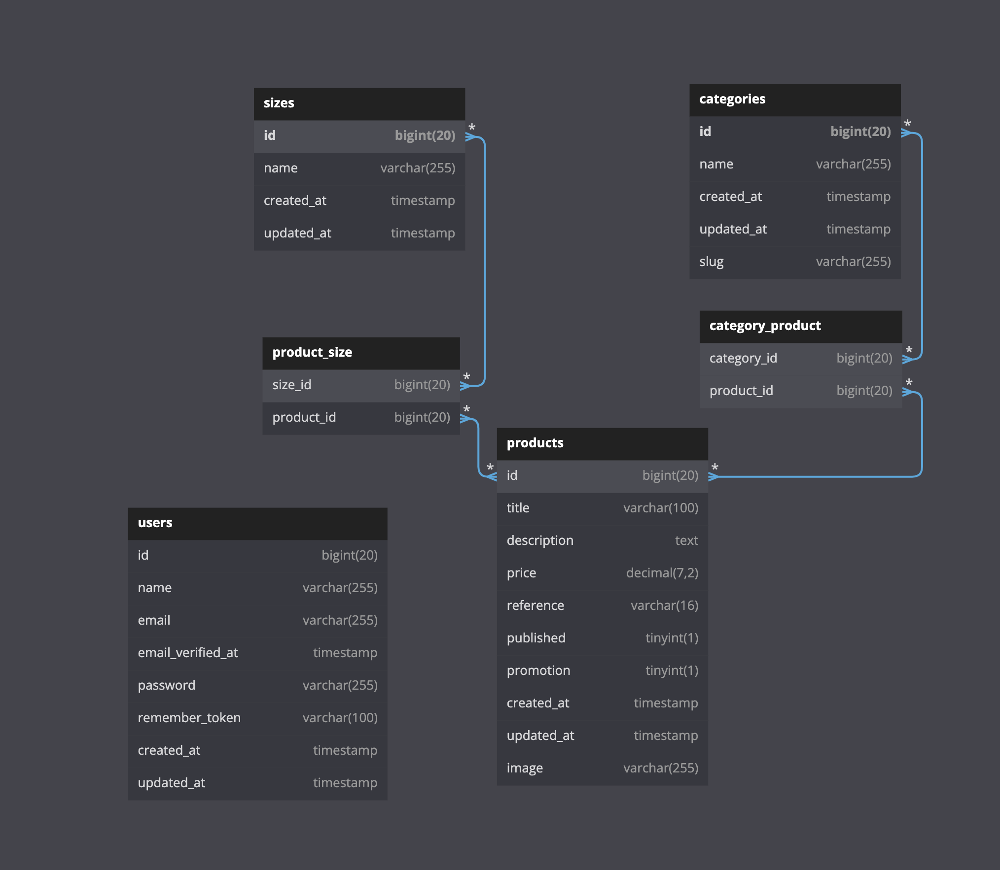

# Projet 2 : We Fashion

### PRÉSENTATION

Vous avez été recruté comme développeur par Edouard, directeur de We Fashion, une nouvelle boutique de e-commerce qui vend des vêtements homme et femme de créateurs. L'objectif de votre travail est de développer la plateforme We Fashion pour qu'elle devienne multicanal. Le développement est interne et utilise le framework Laravel et la base de données MySQL côté serveur.

Plus d'information <a href="./readme_project.md"><u>ici</u></a>

## Prérequis

-   Avoir un mamp/xampp/wampp/lamp d'installé avec PHP v.8 minimum
-   Composer d'installer

## Installation

1. Cloner le projet dans un dossier htdoc de votre server.
2. Rentrer dans le dossier en faisant : `cd we_fashion` et ouvrer le projet dans l'éditeur.
3. À la racine du projet créer un fichier `.env` identique au `.env.example`
    - **Vérifier :**
    - `APP_URL=htt://localhost:8000`
    - `DB_DATABASE=we_fashion`
    - D'avoir bien configurer `DB_DATABASE` `DB_USERNAME` `DB_PASSWORD` suivant votre configuration.
4. Tapez les commandes suivantes:
    - `npm i`
    - `composer up`
    - `php artisan migrate --seed` accepter le warning pour installer la base de données 'we_fashion'. La BDD devrait se remplir de produits.
    - `php artisan storage:link` pour créer un lien accessible au navigateur des images enregistrer dans l'application.
    - `php artisan serve` et dans un autre onglet `npm run dev`.
    - Le site devrait être accessible à l'adresse <a href="http://localhost:8000">http://localhost:8000</a>.
    - il est possible d'avoir un message d'erreur la première fois. L'erreur sugère de générer une `APP_KEY` qu'il faudra accépter.

## La navigation du site

#### La page d'accueil

La barre de navigation permet de se déplacer de la page d'accueil (Logo cliquable) vers les différentes catégories (dynamique - à chaque nouvelle catégorie créée par l'admin elles sont mise à jour côté client).
Les produits sont cliquable elles aussi pour voir le descriptif détaillé.
Si le produit est soldé, un badge (cliquable - permet d'aller à la catégorie des produits soldés) les identifie.
La pagination permet de naviguer entre les différents produits au nombre de 6 par pages.
Le footer présente différent liens.

#### La page de présentation du produit

Les différentes informations sont affichées. Comme sur la page d'accueil le produit est identifié s'il est soldé (comme le prix - 20% de façon arbitraire). La/les catégories sont affichée(s) et permet de naviguer vers la catégorie associée.
On peut choisir une ou plusieur taille à mettre au panier (fictif).

### L'administration

Accessible via cette url : <a href="http://localohost:8000/admin">http://localohost:8000/admin</a>
Si l'admin n'est pas encore connecté il sera redirigé sur la page de login (quelque soit la page d'administration souhaité).
Un admin de présentation à été créé : - email : edouard@admin.com - mot de passe: admin
Une fois connecté l'administrateur est redirigé sur le dashboard.
Dans la barre de navigation le Logo est non cliquable comme demandé dans les consignes. Un lien vers l'accueil du dashboard, un lien vers la création de produits et un autre vers le listing des catégories. 2 icones sont aussi présentes, la première pour nous ramener sur l'accueil du site et l'autre pour nous deconnecter et nous renvoyer vers la page de connexion.
La page d'accueil du dashboard présente les 15 derniers produits créé. Chacun est éditable avec un formulaire prérempli, un bouton de suppression avec un boîte de confirmation. Un bouton nouveau permet à l'administrateur de crééer de nouveaux produits.
Plusieurs règles de validation ont été mise en place lors de la création/modification d'un produit ou d'une catégorie.

## Représentation graphique de la base de données

